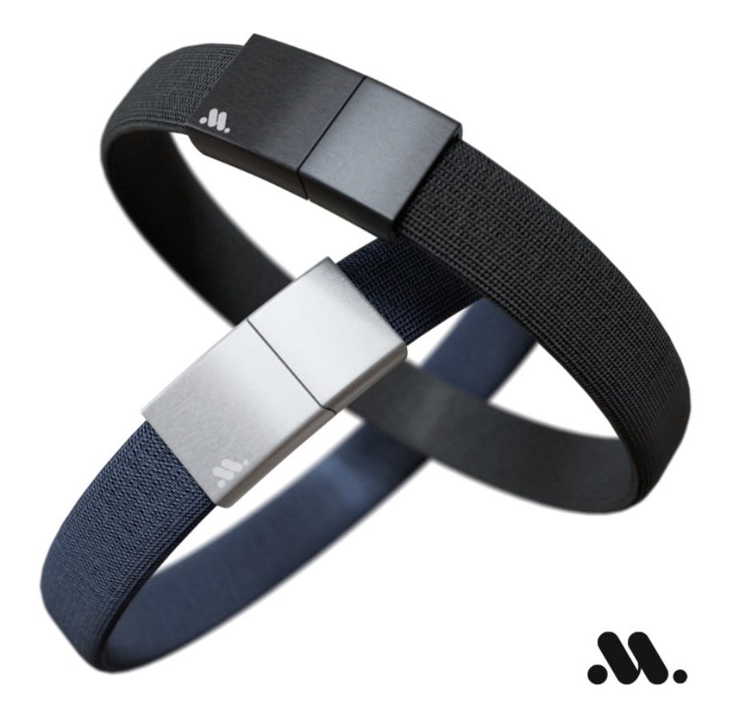
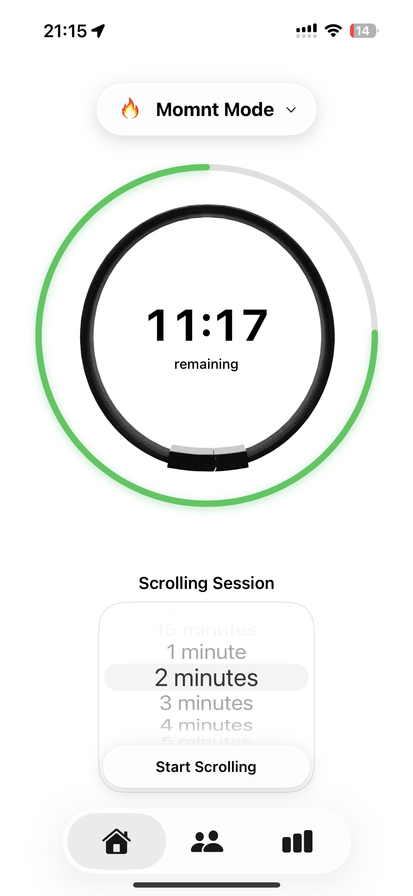
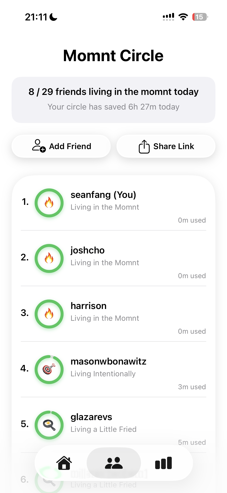
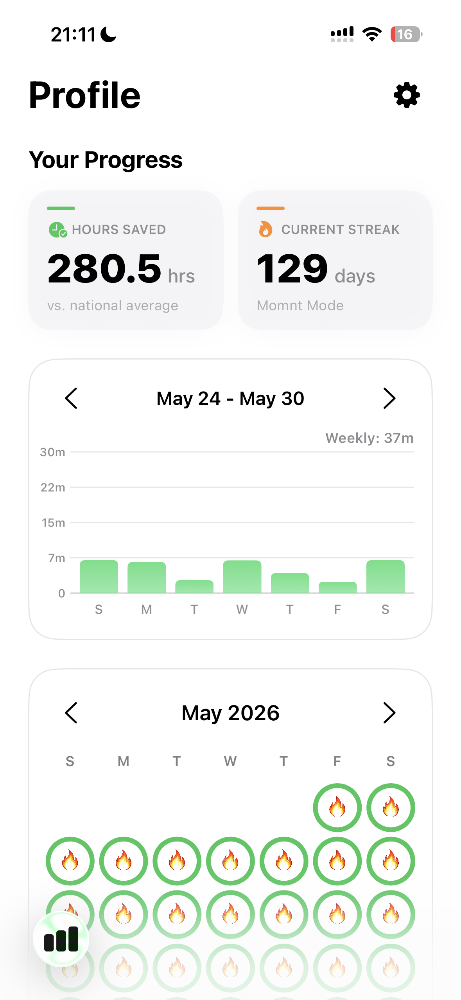
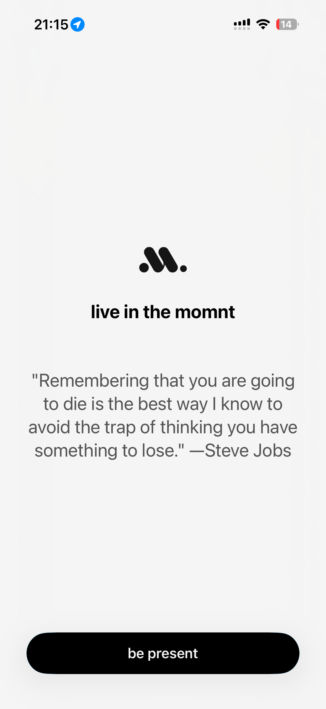
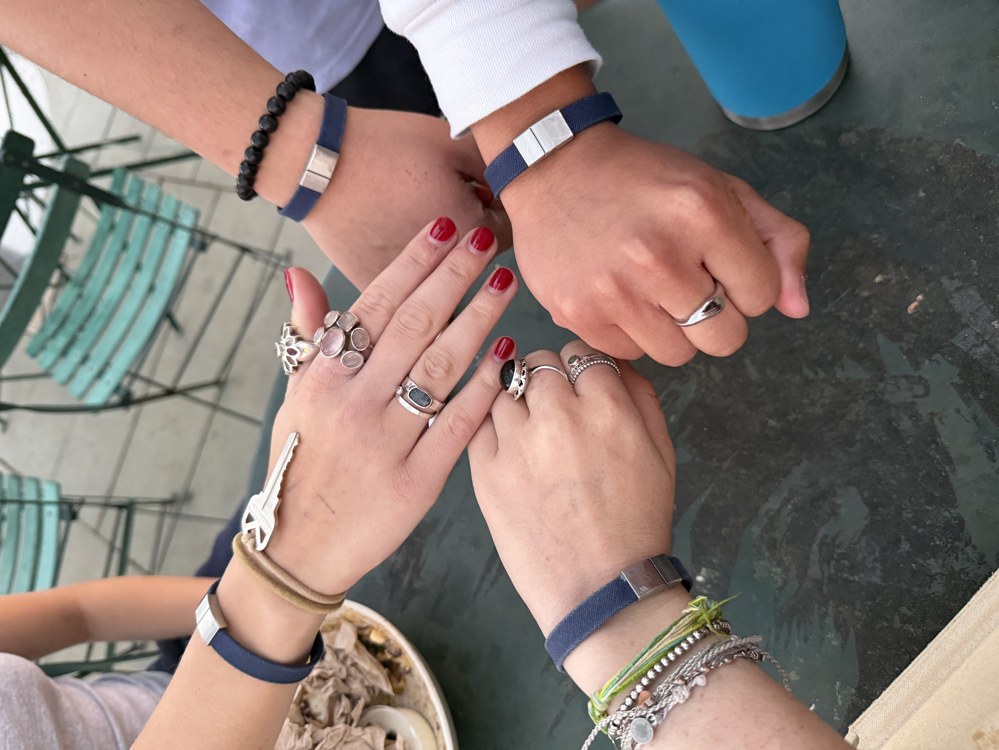
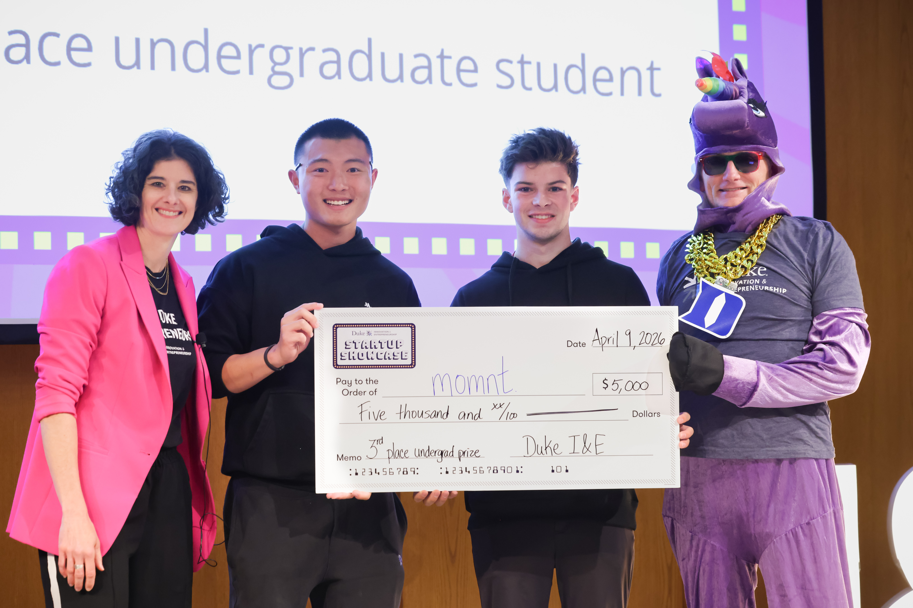

# momnt

momnt is a digital wellness system that helps people intentionally manage screen time through software and an NFC wearable.

## The Problem

Most screen-time apps are either too easy to bypass or requires too much willpower. People want to spend less time on their phones, but relying on willpower alone rarely works.

Think about how many times your 5-min scroll sessions turn into 30-min or more. We're here to stop unintentional phone use so people have more time to enjoy what's really meaningful in the real world.

## The Solution

momnt introduces friction into the process.

Users withdraw time from a daily budget to access distracting apps. When time runs out, access is automatically restricted, helping users use technology more intentionally.

## Traction

- 600 devices manufactured
- 200+ users
- $7,500+ revenue
- Duke Startup Showcase 3rd Place
- DVG IGNITE Competition 4th Place

## Product Display

### Wristband Render

  

### App Screenshots

  
  
  
  

### Real-Life Product Use

  
  
  
  

### Showcase Win

  

## Current Focus

- AI-powered personalization
- Behavior change and habit formation
- User retention and engagement
- Implement neuroscience based nudges to shape positive behaviours

## Founders

Sean Fang & Cole Bonawitz

Duke University students passionate about building a future where people engage with technology more intentionally and cherish their time more in the real world.
